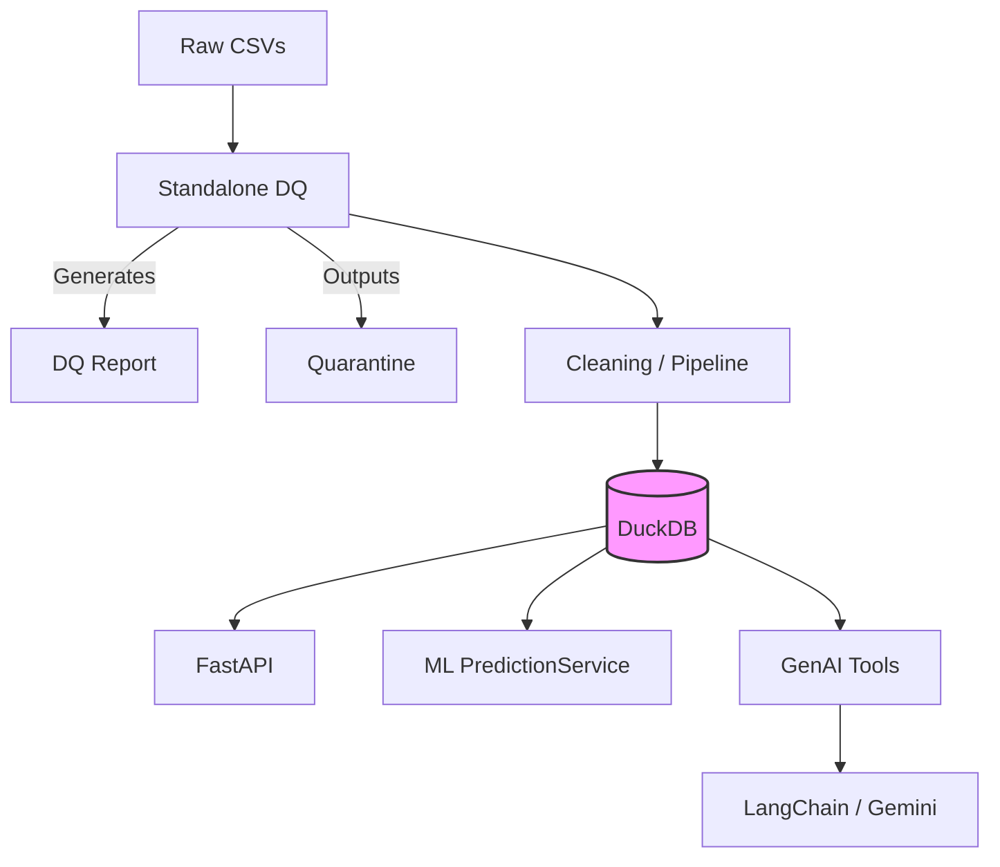

# Supply Chain Intelligence

[](https://github.com/parthrr510/supply-chain-intelligence/actions/workflows/ci.yml)

## 1. Getting started

This project provides a comprehensive Supply Chain Intelligence system, featuring a robust data pipeline, a FastAPI application, a Machine Learning predictive model, and a GenAI CLI assistant.

### Prerequisites

- Docker and Docker Compose
- Python 3.10+ (if running locally without Docker)
- Gemini API Key

### Installation

1. Clone the repository.
2. Copy the example environment file:
   ```bash
   cp .env.example .env
   ```
3. Fill in your `GEMINI_API_KEY` in the `.env` file.

### Docker Compose Startup

Start the entire application using Docker Compose:

```bash
docker-compose up --build
```

This will start the FastAPI service on port 8000 and the Streamlit UI on port 8501. 

**Automatic Provisioning:** If the Data Quality report, the curated DuckDB database, or the ML model artifact are missing, the Docker startup script (`start.sh`) will automatically run the ingestion pipelines and model training to provision them for you before booting the API.

*(If you prefer to run these data ingestion and training pipelines manually, see the commands in the **Production support runbook** below).*

## 2. Architecture diagram



*Note: We migrated to LangChain for the GenAI tool layer during implementation to improve flexibility.*

## 3. Tech choices

### 1. Data Store Selection

**DuckDB** was chosen as the curated analytical datastore. Because this application heavily relies on analytical queries over bulk-ingested data (like computing route statistics and aggregating delays), DuckDB provides superior in-process OLAP performance compared to SQLite, with zero deployment overhead for local setups.

### 2. Scaling to 100x Data Volume

At 100x the data volume, a single-node DuckDB file would become a bottleneck for concurrent writes and large-scale aggregations. I would switch to a distributed Cloud Data Warehouse (such as **Snowflake** or **BigQuery**) for the analytical workloads and ML training. For serving high-throughput operational API requests (like querying a specific shipment's status), I would introduce a fast transactional store like **PostgreSQL**.

### 3. Significant Tools & Libraries

- **Backend (FastAPI):** Chosen for its high performance, automatic OpenAPI documentation, and native asynchronous routing.
- **ML Framework (`scikit-learn`):** A robust, industry-standard library that perfectly handles tabular data and tree-based models like Random Forest.
- **LLM Provider (Google Gemini via LangChain):** Gemini provides excellent reasoning capabilities, while LangChain orchestrates tool-calling and memory more reliably than raw API calls.
- **Test Framework (`pytest`):** Offers simple, concise, and highly reusable test fixtures for both unit and integration tests.
- **CI Platform (GitHub Actions):** Seamless integration with the repository allows for an easily maintainable CI pipeline with no extra infrastructure.
- **Frontend / Assistant UI (Streamlit):** Provides a rapid, interactive Python-based UI that replaces the terminal CLI for the GenAI assistant, making it highly presentable without requiring a separate web framework (like React).

### 4. Explicitly Out of Scope

- **Real-time Streaming Ingestion:** I decided against introducing tools like Kafka or Flink. For the current scale and requirements, batch processing of CSV files is fully sufficient, and avoiding streaming keeps the architecture clean and testable.
- **Complex UI / Frontend:** While we built a Streamlit UI to interact with the AI Assistant, we decided against a complex frontend framework (like React or Vue) to focus engineering effort entirely on building a robust backend and data pipeline.

### 5. ML Feature Engineering & Selection

For the Delay Prediction model, we extract several classes of features to capture the underlying causes of delay while strictly avoiding data leakage (like `actual_departure` or `actual_arrival`). Our chosen features and the rationale for each:

- **Logistical Complexity (`container_count`, `weight_tons`, `cargo_type`):** Larger or heavier shipments, and specific cargo types, often require more complex handling at ports which can introduce delays.
- **Entity Identity (`origin_port`, `destination_port`, `vessel_id`):** Certain vessels or specific routes are historically more prone to delays due to operational patterns.
- **Operational Stress (`origin_congestion_score`, `destination_congestion_score`):** Port congestion is a direct driver of delays. Including the static/average congestion scores allows the tree-based model to weight routes effectively.
- **Route Length (`planned_transit_days`):** Longer planned transit times expose the shipment to a higher probability of unforeseen disruptions (weather, mechanical issues).
- **Temporal Seasonality (`booking_month`, `booking_day_of_week`):** Extracted from the booking date to allow the model to learn seasonal patterns (e.g., holiday peaks) and weekend-related processing bottlenecks.

### 6. AI Agent Guardrails

To ensure the LLM behaves predictably and safely within our CLI assistant layer, we implemented strict system prompt guardrails in LangChain (`ai_agent/assistant/agent.py`):

- **Domain Restriction:** The agent is explicitly instructed to refuse off-domain questions and explain its supported domain (supply-chain operations, shipments, route stats).
- **Anti-Hallucination:** It is strictly forbidden from fabricating facts; all shipment claims must be grounded in tool results.
- **Explicit Citations:** When the model produces a factual claim derived from a tool, it is required to visibly cite the tool that produced the data (e.g., `Source: get_route_stats`).

## 4. Data quality summary

The standalone DQ module processes raw data and identifies issues before loading into DuckDB. The following data anomalies were identified by the DQ framework and handled accordingly:

| Check Name               | Dataset     | Rows Affected | Severity | Action                     |
| ------------------------ | ----------- | ------------- | -------- | -------------------------- |
| Exact Duplicates         | shipments   | 16            | Warning  | Dropped                    |
| Conflicting Duplicates   | shipments   | 40            | Critical | Quarantined                |
| Invalid Origin Port      | shipments   | 42            | Critical | Quarantined                |
| Invalid Destination Port | shipments   | 55            | Critical | Quarantined                |
| Negative Weight          | shipments   | 36            | Warning  | Normalized using`.abs()` |
| Missing Status           | shipments   | 54            | Warning  | Reported                   |
| Missing Event Type       | port_events | 140           | Critical | Quarantined                |

**Reporting**: A DQ JSON report is generated and persisted during ingestion, viewable via the API (`/data-quality/report`).

## 5. Production support runbook

### Environment Variables

- `APP_ENV`: environment name (e.g., dev, prod)
- `LOG_LEVEL`: Logging verbosity (e.g., INFO, DEBUG)
- `GEMINI_API_KEY`: Key for the GenAI assistant
- `DATABASE_PATH`: Path to DuckDB file
- `MODEL_PATH`: Path to the pickled ML artifact

### How to Run DQ and Data Pipeline

The data ingestion pipeline can be run locally via:

```bash
python -m data_engineering.pipeline.ingest
```

This will generate the data quality reports and build the DuckDB tables.

### How to Train/Evaluate the Model

```bash
python -m machine_learning.ml.train
```

This command performs chronological splitting, dynamically tunes the classification threshold, trains the Random Forest model, and saves the artifact to `MODEL_PATH`.

### How to Run the UI & AI Assistant

The Streamlit UI completely replaces the old CLI assistant for a cleaner experience without terminal warnings.

```bash
streamlit run ui/app.py
```

This starts a web application (usually at `http://localhost:8501`) where you can interact with the Supply Chain AI Agent and test the FastAPI endpoints natively.

### Test Commands

Run unit and integration tests using pytest:

```bash
pytest
```

### Verifying Service Health Post-Deployment

To verify the service is running and healthy after a deployment, check the health endpoint:

```bash
curl -X GET http://localhost:8000/health
```

A healthy response will look like: `{"status": "ok", "components": {"database": "up", "model": "loaded"}}`.

### Likely Failure Modes & Diagnosis

1. **Model Artifact Not Found / Fails to Load:**

   - *Diagnosis:* The API will return 500s on the `/predict-delay` endpoint, and the `/health` endpoint will show `"model": "failed"`.
   - *Resolution:* Check the application logs. Ensure `MODEL_PATH` is correctly set and that the ML pipeline (`python -m machine_learning.ml.train`) has successfully run to generate the `.joblib` artifact.
2. **Database Locked or Missing:**

   - *Diagnosis:* DuckDB might throw concurrency or "file not found" errors in the logs.
   - *Resolution:* Check if another process is holding a write lock on the `.duckdb` file. Ensure `DATABASE_PATH` is correct and the volume is correctly mounted in Docker.
3. **GenAI Assistant Failures (Rate Limits or Invalid Key):**

   - *Diagnosis:* The CLI assistant or GenAI API routes throw authentication or quota errors.
   - *Resolution:* Verify the `GEMINI_API_KEY` in the environment variables. Check API usage limits on the provider's dashboard.

### Rolling Back a Bad Release

If a deployment introduces critical bugs:

1. Revert the main branch to the last known stable commit using `git revert <commit_hash>`.
2. Push the reverted commit to trigger the CI/CD pipeline, which will rebuild the Docker image with the stable code.
3. If using container orchestration (like Kubernetes or Docker Swarm), immediately rollback the deployment to the previous stable image tag using `kubectl rollout undo deployment/supply-chain-api` or equivalent.

### Production Enhancements (Next Steps)

If taking this system to a true production environment, the following should be added next:

- **Monitoring & Observability:** Implement Prometheus metrics for API latency/error rates and Grafana dashboards. Add structured JSON logging (e.g., using Datadog or ELK stack).
- **Alerting:** Set up PagerDuty/Slack alerts for when the `/health` endpoint fails, API error rates spike, or the ML model prediction drift exceeds acceptable thresholds.
- **Secrets Management:** Move environment variables like `GEMINI_API_KEY` out of `.env` files and into a secure vault like AWS Secrets Manager or HashiCorp Vault.
- **Infrastructure as Code (IaC):** Use Terraform to provision cloud resources, ensuring repeatable and auditable infrastructure deployments.

## 6. CI/CD

Our CI pipeline runs via GitHub Actions on every push/PR:

1. Installs dependencies.
2. Lints code using Ruff.
3. Formats code check using Ruff.
4. Executes deterministic Unit Tests.
5. Executes Integration Tests.
6. Builds the Docker container to ensure image validity.

## 7. API Usage and Examples

**Get Health Status**

```bash
curl -X GET http://localhost:8000/health
```

**Response:**

```json
{"status": "ok", "components": {"database": "up", "model": "loaded"}}
```

**Query Shipments**

```bash
curl -X GET "http://localhost:8000/shipments?page=1&page_size=10"
```

**Predict Delay**

```bash
curl -X POST http://localhost:8000/predict-delay \
     -H "Content-Type: application/json" \
     -d '{"shipment_id": "SHP-12345"}'
```

**Response:**

```json
{
  "probability": 0.85,
  "prediction": true,
  "threshold": 0.42,
  "model_version": "v1.0"
}
```

## 8. If I had more time

- **Advanced Monitoring**: Implement Prometheus/Grafana metrics for API latency and model prediction drift.
- **Model Enhancements**: Experiment with Gradient Boosting (XGBoost/LightGBM) and incorporate external weather or port congestion datasets as features.
- **Caching**: Add Redis to cache frequently accessed route statistics.
- **GenAI Memory**: Add persistent session memory for multi-turn conversations in LangChain.

## 9. Scaling to production

- **Database**: Move from DuckDB to a distributed analytical database like Snowflake or BigQuery for the curated layer, or PostgreSQL for transaction-like operational reads.
- **Model Monitoring Approach**: Log all inference requests (inputs and probability outputs) to a data warehouse. Periodically join with actual arrival outcomes to compute performance metrics (F1, precision, recall) over time and trigger automated retraining if drift exceeds thresholds.
- **Container Orchestration**: Deploy using Kubernetes to handle autoscaling of the FastAPI pods based on CPU/Memory utilization.
- **CI/CD**: Add deployment stages (Terraform/Helm) to automatically roll out updates to staging and production clusters.

## 10. Known Limitations

- The system currently operates on local CSV files and DuckDB, which is suitable for single-node analysis but not distributed concurrent writes.
- The GenAI assistant only handles text-based tool interactions and is strictly scoped to supply chain routing and delays.

## 11. AI Assistance & Key Engineering Decisions

AI coding assistants were used extensively throughout the project for code scaffolding, implementation, test generation, debugging, documentation, and reviewing the solution against the assignment requirements. AI was also used to explore architectural options, identify potential edge cases (like pathing issues), and rapidly prototype user interfaces.

The key engineering decisions were driven and reviewed manually based on the assignment requirements and the actual dataset. These include:

* **FastAPI + Python** with a modular-monolith architecture.
* **Streamlit UI** for a clean, interactive user experience over a terminal CLI.
* **DuckDB** as the curated analytical data store, with deterministic rebuilds from raw CSVs.
* A standalone **Data Quality pipeline** with validation, normalization, severity levels, reporting, and quarantine mechanisms.
* **Random Forest Classifier** as the baseline delay-prediction model, using booking-time features only and a chronological train/validation/test split.
* A **shared service layer** used by both the API and GenAI tools to avoid duplicated business logic.
* **Gemini native tool calling** for the assistant, with strict domain, grounding, and tool-call-limit guardrails (along with dynamic port code lookup).
* **Docker Compose, pytest, Ruff, and GitHub Actions** for local execution, testing, and CI.
* Scope was deliberately kept focused on the assignment; unnecessary infrastructure such as Kubernetes, Terraform, Kafka, Redis, RAG, and vector databases were intentionally not introduced.
